---
## Front matter
lang: ru-RU
title: "Л.1. Установка и конфигурация операционной системы на виртуальную машину"
author: "Греков Максим Сергеевич"
institute: RUDN University, Moscow, Russian Federation
date: 2021

## Formatting
mainfont: PT Serif
romanfont: PT Serif
sansfont: PT Serif
monofont: PT Serif
toc: false
slide_level: 2
theme: metropolis
header-includes: 
 - \metroset{progressbar=frametitle,sectionpage=progressbar,numbering=fraction}
 - '\makeatletter'
 - '\beamer@ignorenonframefalse'
 - '\makeatother'
aspectratio: 43
section-titles: true
---

# Цель работы

## Цель работы

Целью данной лабораторной работы является:

- приобретение практических навыков установки операционной системы на виртуальную машину
- настройки минимально необходимых для дальнейшей работы сервисов

# Ход работы 

## Подготовка к установке

Установили виртуальную машину VirtualBox, скачали дистрибутив операционной системы Linux Centos.

Создали каталог с именем пользователя для хранения файлов виртуальной машины.

Запустили VirtualBox и задали месторасположение каталога для виртуальных машин.

## Подготовка к установке

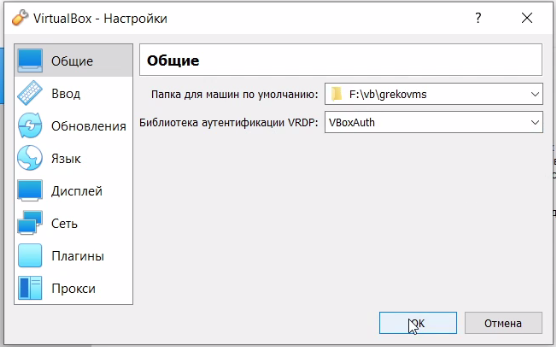{ #fig:001 width=95% }

## Подготовка к установке

Создали новую виртуальную машину со следующими параметрами:

- имя виртуальной машины — Base
- тип операционной системы — Linux, RedHat
- размер основной памяти виртуальной машины — 1024 МБ

## Подготовка к установке

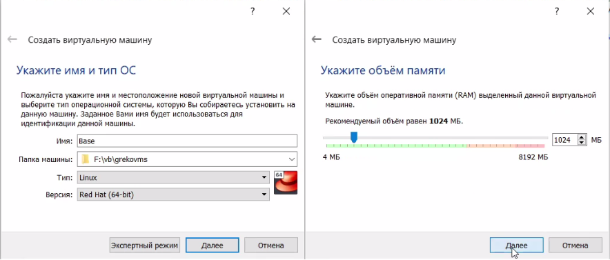{ #fig:002 width=100% }

## Подготовка к установке

Создали новый виртуальный жесткий диск и задали его конфигурацию: 

- загрузочный, VDI (BirtualBoxDisk Image)
- динамический виртуальный диск
- размер жесткого диска — 20 ГБ
- расположение жесткого диска в рабочем каталоге пользователя

## Подготовка к установке

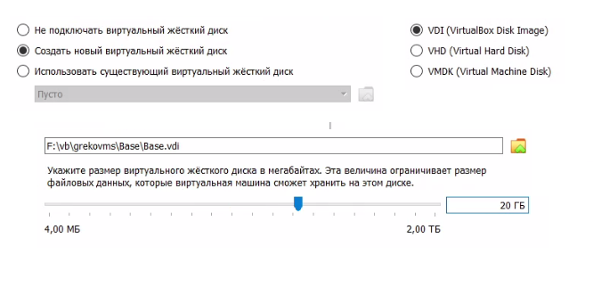{ #fig:003 width=100% }

## Подготовка к установке

Проверили правильность выбранной папки для снимков виртуальной машины:

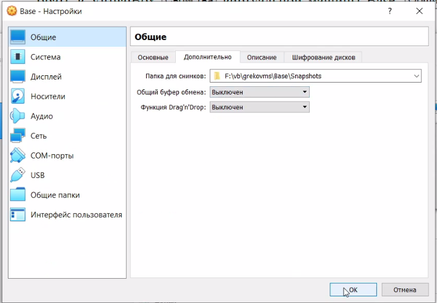{ #fig:004 width=80% }

## Подготовка к установке

Добавили новый привод оптических дисков и выбрали раннее скачанный образ:

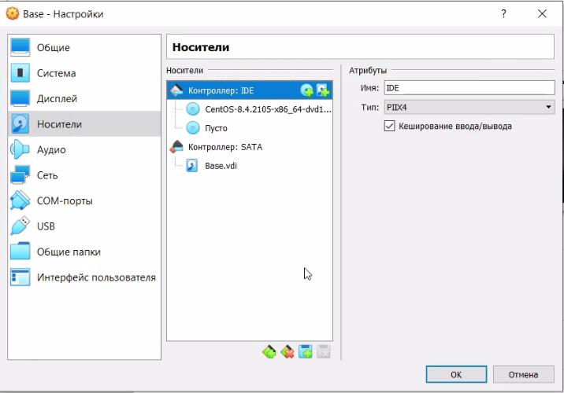{ #fig:005 width=80% }

## Начало установки

Запустили виртуальную машину Base, выбрали установку системы на жёсткий диск:

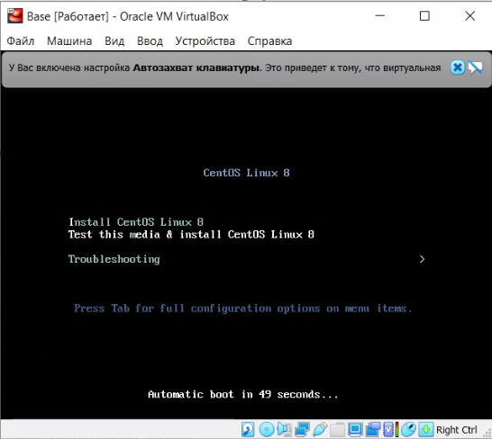{ #fig:006 width=60% }

## Процесс установки

Установили русский язык для интерфейса и раскладки клавиатуры:

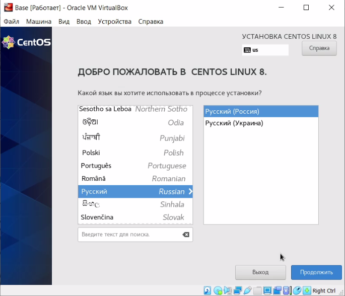{ #fig:007 width=60% }

## Процесс установки

- Установили конфигурацию жесткого диска
- Создали root пароль
- Создали пользователя и назначили его администратором
- Установили часовой пояс
- Произвели выбор программ для установки
- Задали сетевое имя виртуальной машины 

## Процесс установки

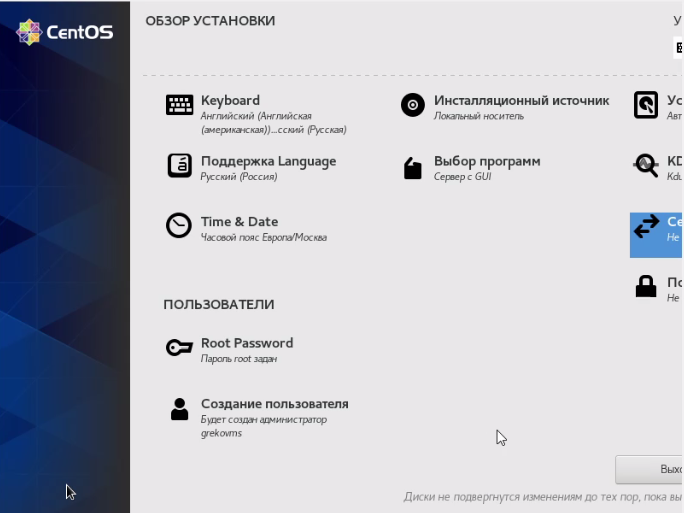{ #fig:008 width=80% }

## Процесс установки

Запустили процесс установки:

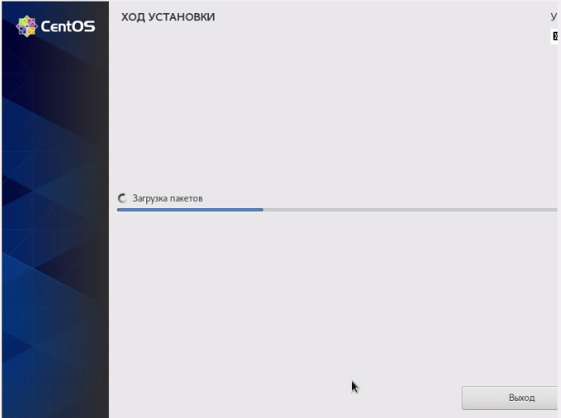{ #fig:009 width=80% }


## Процесс установки

Ознакомились и подтвердили информацию о лицензионном соглашении:

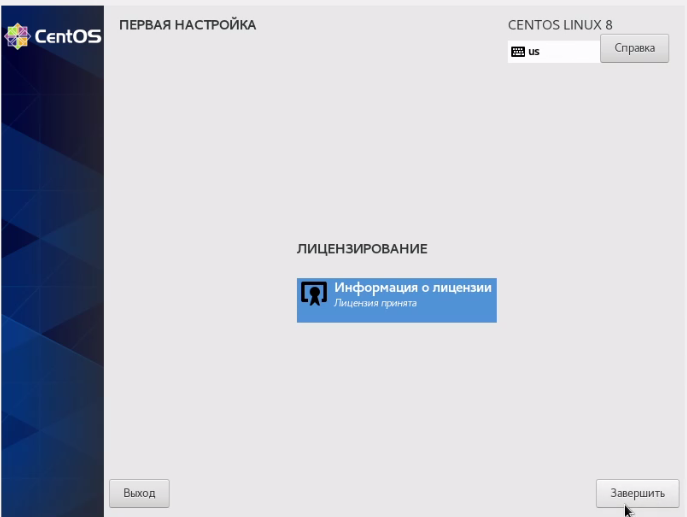{ #fig:010 width=70% }

## Завершение установки

Подключились к виртуальной машине с помощью созданной учётной записи:

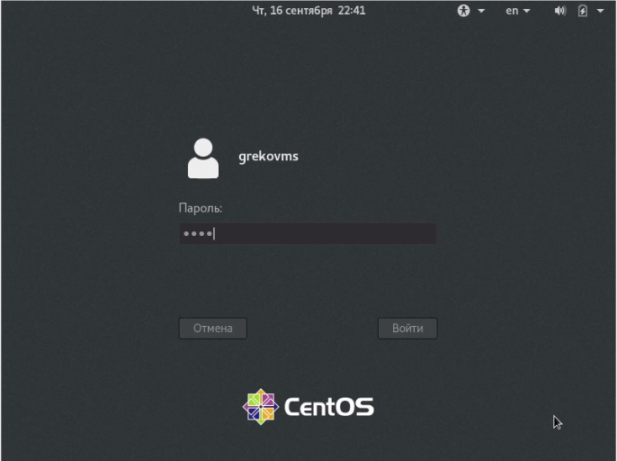{ #fig:011 width=70% }

## Завершение установки

Изменили разрешение экрана наиболее подходящее:

{ #fig:012 width=100% }

## Настройка

На виртуальной машине Base запустили терминал, перешли под учетную запись root с помощью команды su:

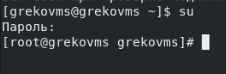{ #fig:013 width=100% }

## Настройка

С помощью команд ```yum update``` и ```yum install mc``` обновили системные файлы и установили необходимую программу:

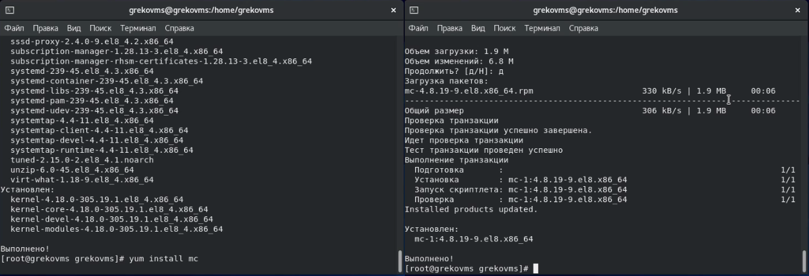{ #fig:014 width=100% }

## Настройка

После установки необходимых программ завершили работу виртуальной машины.

Применили настройки для того, чтобы другие виртуальные машины могли использовать машину Base и её конфигурацию как базовую.

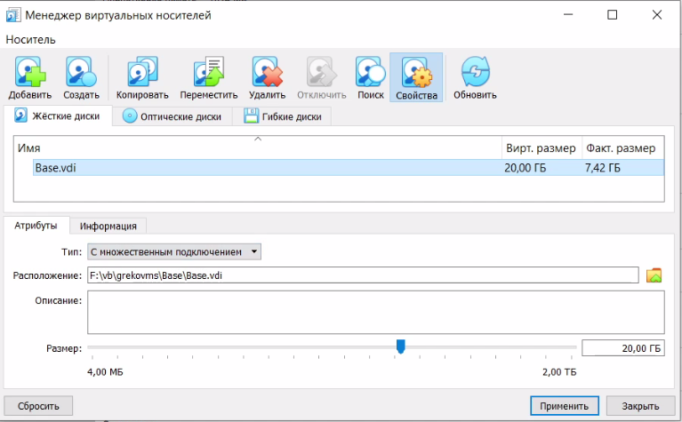{ #fig:015 width=60% }

## Настройка

На основе виртуальной машины Base создали машину Host2, указав в конфигурации виртуального жёсткого диска «Использовать существующий жёсткий диск» Base.vdi:

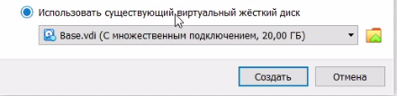{ #fig:016 width=100% }

# Вывод

## Вывод

В ходе лабораторной работы приобрели практические навыки установки операционной системы на виртуальную машину и настроили минимально необходимые для дальнейшей работы сервисы.

## {.standout}