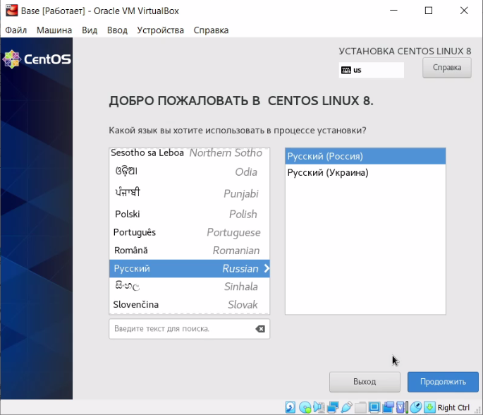
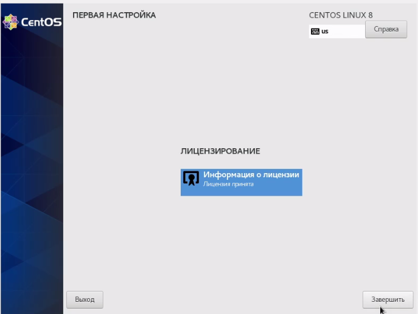
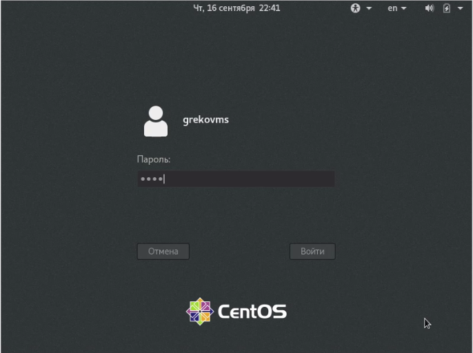

---
# Front matter
lang: ru-RU
title: "Информационная безопасность"
subtitle: "Л.1. Установка и конфигурация операционной системы на виртуальную машину"
author: "Греков Максим Сергеевич"
institute: RUDN University, Moscow, Russian Federation
date: 2021

# Formatting
toc-title: "Содержание"
toc: true # Table of contents
toc_depth: 2
lof: true # List of figures
lot: false # List of tables
fontsize: 12pt
linestretch: 1.5
papersize: a4paper
documentclass: scrreprt
polyglossia-lang: russian
polyglossia-otherlangs: english
mainfont: PT Serif
romanfont: PT Serif
sansfont: PT Serif
monofont: PT Serif
mainfontoptions: Ligatures=TeX
romanfontoptions: Ligatures=TeX
sansfontoptions: Ligatures=TeX,Scale=MatchLowercase
monofontoptions: Scale=MatchLowercase
indent: true
pdf-engine: lualatex
header-includes:
  - \linepenalty=10 # the penalty added to the badness of each line within a paragraph (no associated penalty node) Increasing the value makes tex try to have fewer lines in the paragraph.
  - \interlinepenalty=0 # value of the penalty (node) added after each line of a paragraph.
  - \hyphenpenalty=50 # the penalty for line breaking at an automatically inserted hyphen
  - \exhyphenpenalty=50 # the penalty for line breaking at an explicit hyphen
  - \binoppenalty=700 # the penalty for breaking a line at a binary operator
  - \relpenalty=500 # the penalty for breaking a line at a relation
  - \clubpenalty=150 # extra penalty for breaking after first line of a paragraph
  - \widowpenalty=150 # extra penalty for breaking before last line of a paragraph
  - \displaywidowpenalty=50 # extra penalty for breaking before last line before a display math
  - \brokenpenalty=100 # extra penalty for page breaking after a hyphenated line
  - \predisplaypenalty=10000 # penalty for breaking before a display
  - \postdisplaypenalty=0 # penalty for breaking after a display
  - \floatingpenalty = 20000 # penalty for splitting an insertion (can only be split footnote in standard LaTeX)
  - \raggedbottom # or \flushbottom
  - \usepackage{float} # keep figures where there are in the text
  - \floatplacement{figure}{H} # keep figures where there are in the text
---

# Цель работы

Целью данной лабораторной работы является:

- приобретение практических навыков установки операционной системы на виртуальную машину
- настройки минимально необходимых для дальнейшей работы сервисов

# Ход работы 

## Подготовка к установке

Установили виртуальную машину VirtualBox, скачали дистрибутив операционной системы Linux Centos.

Создали каталог с именем пользователя для хранения файлов виртуальной машины.

Запустили VirtualBox и задали месторасположение каталога для виртуальных машин.

{ #fig:001 width=95% }

Создали новую виртуальную машину со следующими параметрами:

- имя виртуальной машины — Base
- тип операционной системы — Linux, RedHat
- размер основной памяти виртуальной машины — 1024 МБ

{ #fig:002 width=100% }

Создали новый виртуальный жесткий диск и задали его конфигурацию: 

- загрузочный, VDI (BirtualBoxDisk Image)
- динамический виртуальный диск
- размер жесткого диска — 20 ГБ
- расположение жесткого диска в рабочем каталоге пользователя

{ #fig:003 width=100% }

Проверили правильность выбранной папки для снимков виртуальной машины:

{ #fig:004 width=80% }

Добавили новый привод оптических дисков и выбрали раннее скачанный образ:

{ #fig:005 width=80% }

## Начало установки

Запустили виртуальную машину Base, выбрали установку системы на жёсткий диск:

{ #fig:006 width=60% }

## Процесс установки

Установили русский язык для интерфейса и раскладки клавиатуры:

{ #fig:007 width=60% }

- Установили конфигурацию жесткого диска
- Создали root пароль
- Создали пользователя и назначили его администратором
- Установили часовой пояс
- Произвели выбор программ для установки
- Задали сетевое имя виртуальной машины 

{ #fig:008 width=80% }

Запустили процесс установки:

{ #fig:009 width=80% }

Ознакомились и подтвердили информацию о лицензионном соглашении:

{ #fig:010 width=70% }

## Завершение установки

Подключились к виртуальной машине с помощью созданной учётной записи:

{ #fig:011 width=70% }

Изменили разрешение экрана наиболее подходящее:

{ #fig:012 width=100% }

## Настройка

На виртуальной машине Base запустили терминал, перешли под учетную запись root с помощью команды su:

{ #fig:013 width=100% }


С помощью команд ```yum update``` и ```yum install mc``` обновили системные файлы и установили необходимую программу:

{ #fig:014 width=100% }


После установки необходимых программ завершили работу виртуальной машины.

Применили настройки для того, чтобы другие виртуальные машины могли использовать машину Base и её конфигурацию как базовую.

{ #fig:015 width=60% }

На основе виртуальной машины Base создали машину Host2, указав в конфигурации виртуального жёсткого диска «Использовать существующий жёсткий диск» Base.vdi:

{ #fig:016 width=100% }

# Вывод

В ходе лабораторной работы приобрели практические навыки установки операционной системы на виртуальную машину и настроили минимально необходимые для дальнейшей работы сервисы.