---
## Front matter
lang: ru-RU
title: "Л.2. Дискреционное разграничение прав в Linux. Основные атрибуты"
author: "Греков Максим Сергеевич"
institute: RUDN University, Moscow, Russian Federation
date: 2021

## Formatting
mainfont: PT Serif
romanfont: PT Serif
sansfont: PT Serif
monofont: PT Serif
toc: false
slide_level: 2
theme: metropolis
header-includes: 
 - \metroset{progressbar=frametitle,sectionpage=progressbar,numbering=fraction}
 - '\makeatletter'
 - '\beamer@ignorenonframefalse'
 - '\makeatother'
aspectratio: 43
section-titles: true
---

# Цель работы

## Цель работы

Целью данной лабораторной работы является получение практических навыков работы в консоли с атрибутами файлов, закрепление теоретических основ дискреционного разграничения доступа в современных системах с открытым кодом на базе ОС Linux.

# Ход работы 

## Новый пользователь и вход

1. В установленной при выполнении предыдущей лабораторной работы операционной системе создали учётную запись пользователя guest.

2. Задали пароль для пользователя guest

3. Вошли в систему от имени пользователя guest.

4. Определили директорию, в которой находились, командой pwd. Она совпадала с приглашением командной строки. Определили домашнюю директорию и перешли в нее.

## Новый пользователь и вход

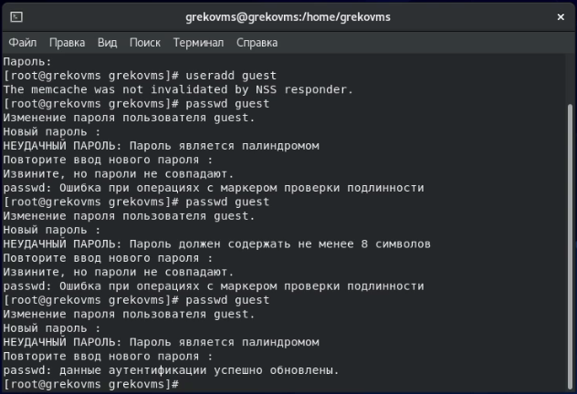{ #fig:001 width=80% }

## Новый пользователь и вход 

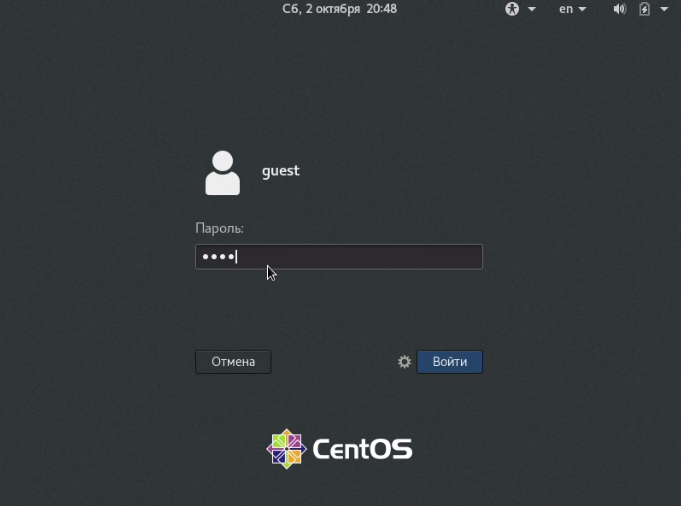{ #fig:002 width=80% }

## Информация о новом пользователе

5. Уточнили имя пользователя командой whoami.

6. Уточнили имя пользователя, его группу, а также группы, куда входит пользователь, командой id. Вывод id совпал с выводом команды groups.

7. Сравнили полученную информацию об имени пользователя с данными, выводимыми в приглашении командной строки, они идентичны.

8. Просмотрели файл /etc/passwd командой cat /etc/passwd и командой cat /etc/passwd | grep guest.

## Информация о новом пользователе

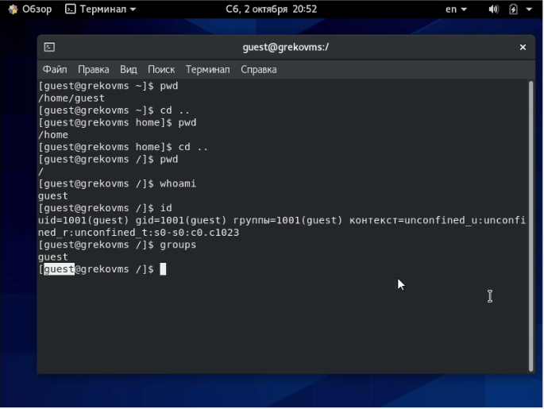{ #fig:003 width=80% }

## Информация о новом пользователе

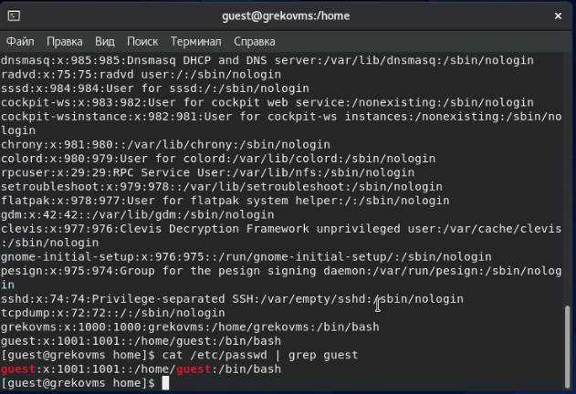{ #fig:004 width=80% }

## Существующие директории и их атрибуты

9. Определили существующие в системе директории командой ls -l /home/. Увидели, какие права доступа установлены на директориях. 

10. Проверили, какие расширенные атрибуты установлены на поддиректориях, находящихся в директории /home, командой: lsattr /home

Удалось увидеть расширенные атрибуты директории нашего пользователя, но не других пользователей.

11. Создали в домашней директории поддиректорию dir1 командой mkdir dir1. Определили командами ls -l и lsattr, какие права доступа и расширенные атрибуты были выставлены на директорию dir1.

## Существующие директории и их атрибуты

{ #fig:005 width=80% }

## Существующие директории и их атрибуты

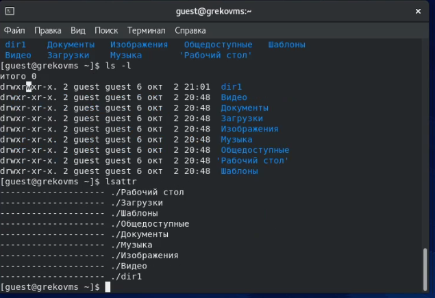{ #fig:006 width=80% }

## Изменение атрибутов и проверка

12. Сняли с директории dir1 все атрибуты командой chmod 000 dir1 и проверили с её помощью правильность выполнения команды ls -l

13. Попытались создать в директории dir1 файл file1 командой echo "test" > /home/guest/dir1/file1 и получили отказ, так как не имеем на это действие прав доступа. Сообщение об ошибке дало подтверждение того, что файл не был создан, проверили это командой ls -l /home/guest/dir1

## Изменение атрибутов и проверка

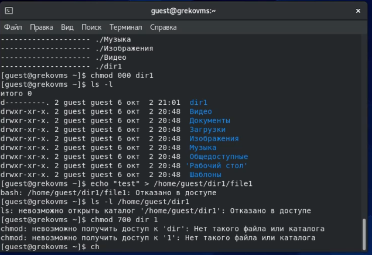{ #fig:007 width=80% }

## Изменение атрибутов и проверка

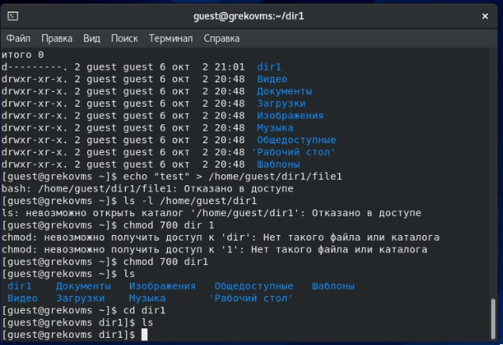{ #fig:008 width=80% }

## Таблица «Установленные права и разрешённые действия»

- Заполнили таблицу «Установленные права и разрешённые действия», выполняя действия от имени владельца директории (файлов), определяя опытным путём, какие операции разрешены, а какие нет.

- Если операция разрешена, занесли в таблицу знак «+», если не разрешена, знак «-».

## Таблица «Установленные права и разрешённые действия»

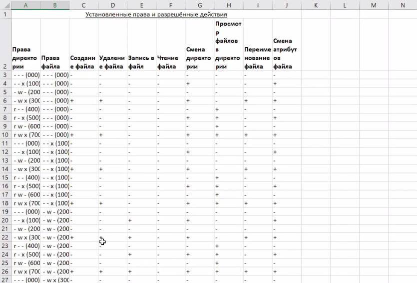{ #fig:009 width=80% }

## Таблица «Установленные права и разрешённые действия»

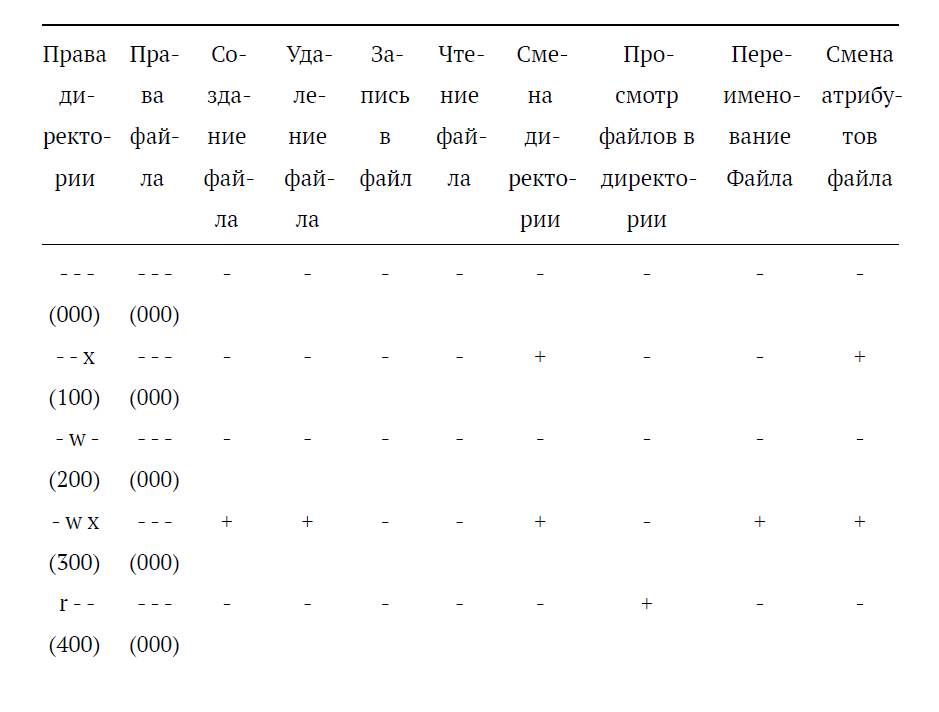{ #fig:011 width=80% }

## Таблица «Минимальные права для совершения операций»

На основании заполненной таблицы определили те или иные минимально необходимые права для выполнения операций внутри директории dir1, заполнили вторую таблицу "Минимальные права для совершения операций".

## Таблица «Минимальные права для совершения операций»

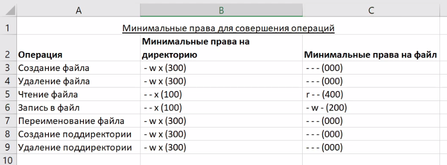{ #fig:010 width=80% }

## Таблица «Минимальные права для совершения операций»

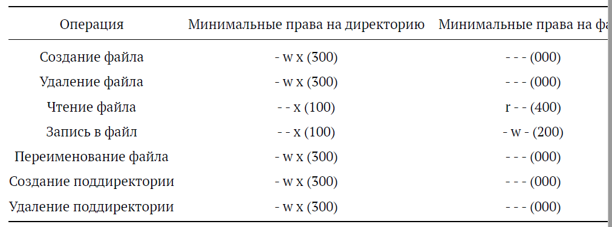{ #fig:012 width=80% }

# Вывод

## Вывод

В ходе лабораторной работы получили практические навыки работы в консоли с атрибутами файлов, закрепили теоретические основы дискреционного разграничения доступа в современных системах с открытым кодом на базе ОС Linux.

## {.standout}