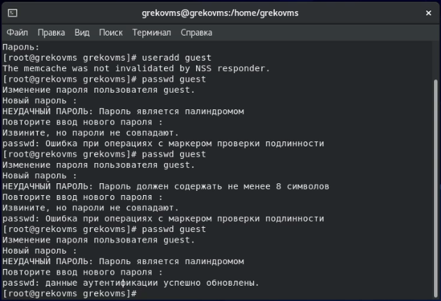
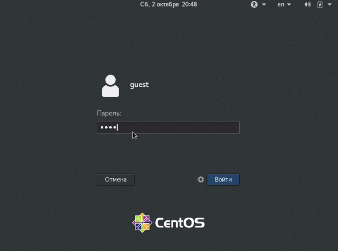
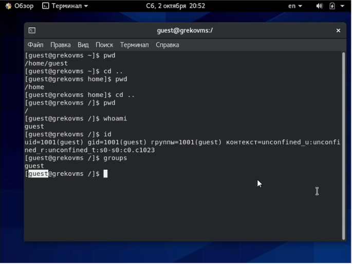
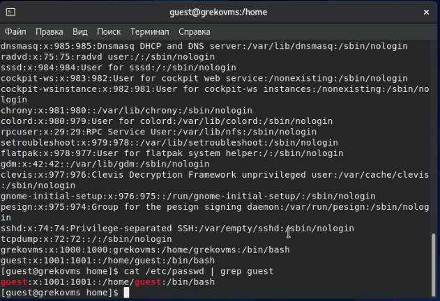
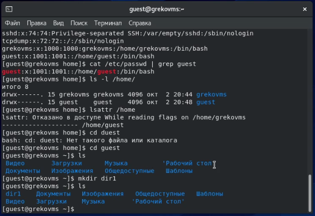
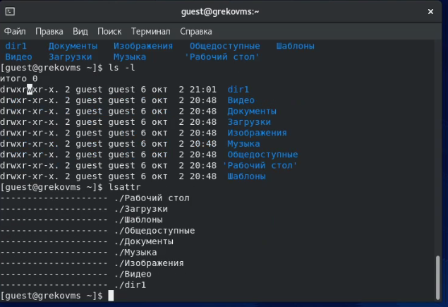
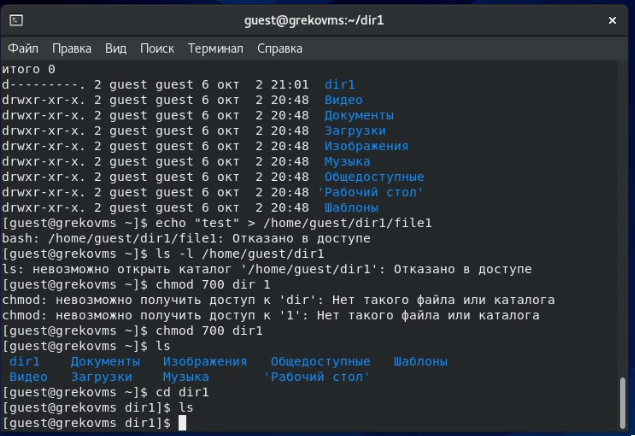
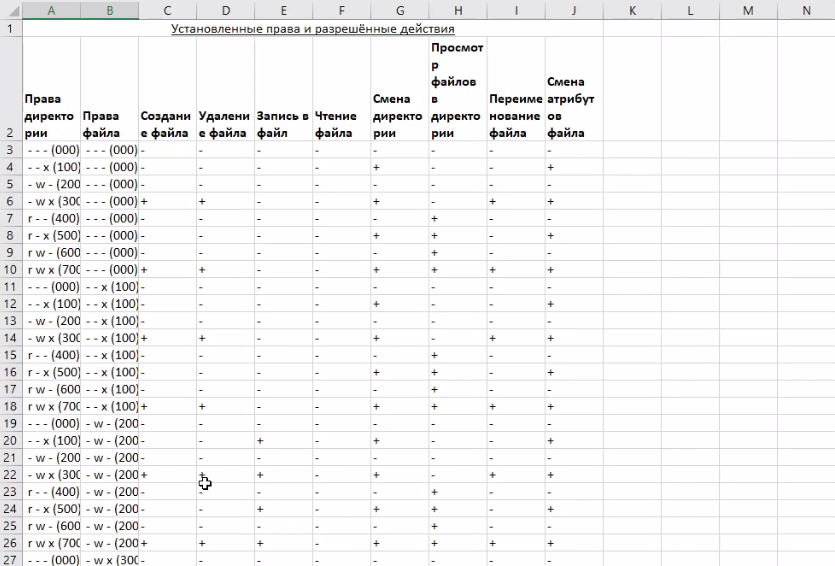
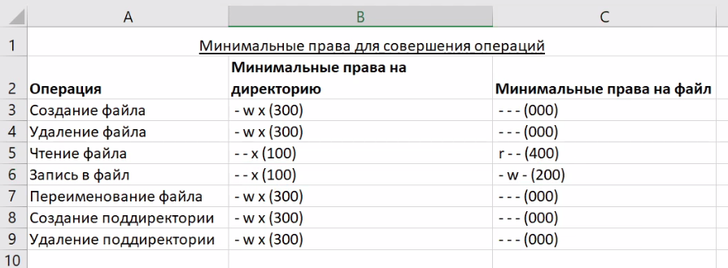

---
# Front matter
lang: ru-RU
title: "Информационная безопасность"
subtitle: "Л.2. Дискреционное разграничение прав в Linux. Основные атрибуты"
author: "Греков Максим Сергеевич"
institute: RUDN University, Moscow, Russian Federation
date: 2021

# Formatting
toc-title: "Содержание"
toc: true # Table of contents
toc_depth: 2
lof: true # List of figures
lot: false # List of tables
fontsize: 12pt
linestretch: 1.5
papersize: a4paper
documentclass: scrreprt
polyglossia-lang: russian
polyglossia-otherlangs: english
mainfont: PT Serif
romanfont: PT Serif
sansfont: PT Serif
monofont: PT Serif
mainfontoptions: Ligatures=TeX
romanfontoptions: Ligatures=TeX
sansfontoptions: Ligatures=TeX,Scale=MatchLowercase
monofontoptions: Scale=MatchLowercase
indent: true
pdf-engine: lualatex
header-includes:
  - \linepenalty=10 # the penalty added to the badness of each line within a paragraph (no associated penalty node) Increasing the value makes tex try to have fewer lines in the paragraph.
  - \interlinepenalty=0 # value of the penalty (node) added after each line of a paragraph.
  - \hyphenpenalty=50 # the penalty for line breaking at an automatically inserted hyphen
  - \exhyphenpenalty=50 # the penalty for line breaking at an explicit hyphen
  - \binoppenalty=700 # the penalty for breaking a line at a binary operator
  - \relpenalty=500 # the penalty for breaking a line at a relation
  - \clubpenalty=150 # extra penalty for breaking after first line of a paragraph
  - \widowpenalty=150 # extra penalty for breaking before last line of a paragraph
  - \displaywidowpenalty=50 # extra penalty for breaking before last line before a display math
  - \brokenpenalty=100 # extra penalty for page breaking after a hyphenated line
  - \predisplaypenalty=10000 # penalty for breaking before a display
  - \postdisplaypenalty=0 # penalty for breaking after a display
  - \floatingpenalty = 20000 # penalty for splitting an insertion (can only be split footnote in standard LaTeX)
  - \raggedbottom # or \flushbottom
  - \usepackage{float} # keep figures where there are in the text
  - \floatplacement{figure}{H} # keep figures where there are in the text
---

# Цель работы

Целью данной лабораторной работы является получение практических навыков работы в консоли с атрибутами файлов, закрепление теоретических основ дискреционного разграничения доступа в современных системах с открытым кодом на базе ОС Linux.

# Ход работы 

## Новый пользователь и вход

1. В установленной при выполнении предыдущей лабораторной работы операционной системе создали учётную запись пользователя guest.

2. Задали пароль для пользователя guest

3. Вошли в систему от имени пользователя guest.

4. Определили директорию, в которой находились, командой pwd. Она совпадала с приглашением командной строки. Определили домашнюю директорию и перешли в нее.

{ #fig:001 width=80% }

{ #fig:002 width=80% }

## Информация о новом пользователе

5. Уточнили имя пользователя командой whoami.

6. Уточнили имя пользователя, его группу, а также группы, куда входит пользователь, командой id. Вывод id совпал с выводом команды groups.

7. Сравнили полученную информацию об имени пользователя с данными, выводимыми в приглашении командной строки, они идентичны.

8. Просмотрели файл /etc/passwd командой cat /etc/passwd и командой cat /etc/passwd | grep guest.

{ #fig:003 width=80% }

{ #fig:004 width=80% }

## Существующие директории и их атрибуты

9. Определили существующие в системе директории командой ls -l /home/. Увидели, какие права доступа установлены на директориях. 

10. Проверили, какие расширенные атрибуты установлены на поддиректориях, находящихся в директории /home, командой: lsattr /home

Удалось увидеть расширенные атрибуты директории нашего пользователя, но не других пользователей.

11. Создали в домашней директории поддиректорию dir1 командой mkdir dir1. Определили командами ls -l и lsattr, какие права доступа и расширенные атрибуты были выставлены на директорию dir1.

{ #fig:005 width=80% }

{ #fig:006 width=80% }

## Изменение атрибутов и проверка

12. Сняли с директории dir1 все атрибуты командой chmod 000 dir1 и проверили с её помощью правильность выполнения команды ls -l

13. Попытались создать в директории dir1 файл file1 командой echo "test" > /home/guest/dir1/file1 и получили отказ, так как не имеем на это действие прав доступа. Сообщение об ошибке дало подтверждение того, что файл не был создан, проверили это командой ls -l /home/guest/dir1

{ #fig:007 width=80% }

{ #fig:008 width=80% }

## Таблица «Установленные права и разрешённые действия»

- Заполнили таблицу «Установленные права и разрешённые действия», выполняя действия от имени владельца директории (файлов), определяя опытным путём, какие операции разрешены, а какие нет.

- Если операция разрешена, занесли в таблицу знак «+», если не разрешена, знак «-».

{ #fig:009 width=80% }

| Права директории | Права файла | Создание файла | Удаление файла | Запись в файл | Чтение файла | Смена директории | Просмотр файлов в директории | Переименование Файла | Смена атрибутов файла |
|:----------------:|:-----------:|:--------------:|:--------------:|:-------------:|:------------:|:----------------:|:----------------------------:|:--------------------:|:---------------------:|
| - - - (000)      | - - - (000) |        -       |        -       |       -       |       -      |        -         |              -               |          -           |           -           |
| - - x (100)      | - - - (000) |        -       |        -       |       -       |       -      |        +         |              -               |          -           |           +           |
| - w - (200)      | - - - (000) |        -       |        -       |       -       |       -      |        -         |              -               |          -           |           -           |
| - w x (300)      | - - - (000) |        +       |        +       |       -       |       -      |        +         |              -               |          +           |           +           |
| r - - (400)      | - - - (000) |        -       |        -       |       -       |       -      |        -         |              +               |          -           |           -           |
| r - x (500)      | - - - (000) |        -       |        -       |       -       |       -      |        +         |              +               |          -           |           +           |
| r w - (600)      | - - - (000) |        -       |        -       |       -       |       -      |        -         |              +               |          -           |           -           |
| r w x (700)      | - - - (000) |        +       |        +       |       -       |       -      |        +         |              +               |          +           |           +           |
| - - - (000)      | - - x (100) |        -       |        -       |       -       |       -      |        -         |              -               |          -           |           -           |
| - - x (100)      | - - x (100) |        -       |        -       |       -       |       -      |        +         |              -               |          -           |           +           |
| - w - (200)      | - - x (100) |        -       |        -       |       -       |       -      |        -         |              -               |          -           |           -           |
| - w x (300)      | - - x (100) |        +       |        +       |       -       |       -      |        +         |              -               |          +           |           +           |
| r - - (400)      | - - x (100) |        -       |        -       |       -       |       -      |        -         |              +               |          -           |           -           |
| r - x (500)      | - - x (100) |        -       |        -       |       -       |       -      |        +         |              +               |          -           |           +           |
| r w - (600)      | - - x (100) |        -       |        -       |       -       |       -      |        -         |              +               |          -           |           -           |
| r w x (700)      | - - x (100) |        +       |        +       |       -       |       -      |        +         |              +               |          +           |           +           |
| - - - (000)      | - w - (200) |        -       |        -       |       -       |       -      |        -         |              -               |          -           |           -           |
| - - x (100)      | - w - (200) |        -       |        -       |       +       |       -      |        +         |              -               |          -           |           +           |
| - w - (200)      | - w - (200) |        -       |        -       |       -       |       -      |        -         |              -               |          -           |           -           |
| - w x (300)      | - w - (200) |        +       |        +       |       +       |       -      |        +         |              -               |          +           |           +           |
| r - - (400)      | - w - (200) |        -       |        -       |       -       |       -      |        -         |              +               |          -           |           -           |
| r - x (500)      | - w - (200) |        -       |        -       |       +       |       -      |        +         |              +               |          -           |           +           |
| r w - (600)      | - w - (200) |        -       |        -       |       -       |       -      |        -         |              +               |          -           |           -           |
| r w x (700)      | - w - (200) |        +       |        +       |       +       |       -      |        +         |              +               |          +           |           +           |
| - - - (000)      | - w x (300) |        -       |        -       |       -       |       -      |        -         |              -               |          -           |           -           |
| - - x (100)      | - w x (300) |        -       |        -       |       +       |       -      |        +         |              -               |          -           |           +           |
| - w - (200)      | - w x (300) |        -       |        -       |       -       |       -      |        -         |              -               |          -           |           -           |
| - w x (300)      | - w x (300) |        +       |        +       |       +       |       -      |        +         |              -               |          +           |           +           |
| r - - (400)      | - w x (300) |        -       |        -       |       -       |       -      |        -         |              +               |          -           |           -           |
| r - x (500)      | - w x (300) |        -       |        -       |       +       |       -      |        +         |              +               |          -           |           +           |
| r w - (600)      | - w x (300) |        -       |        -       |       -       |       -      |        -         |              +               |          -           |           -           |
| r w x (700)      | - w x (300) |        +       |        +       |       +       |       -      |        +         |              +               |          +           |           +           |
| - - - (000)      | r - - (400) |        -       |        -       |       -       |       -      |        -         |              -               |          -           |           -           |
| - - x (100)      | r - - (400) |        -       |        -       |       -       |       +      |        +         |              -               |          -           |           +           |
| - w - (200)      | r - - (400) |        -       |        -       |       -       |       -      |        -         |              -               |          -           |           -           |
| - w x (300)      | r - - (400) |        +       |        +       |       -       |       +      |        +         |              -               |          +           |           +           |
| r - - (400)      | r - - (400) |        -       |        -       |       -       |       -      |        -         |              +               |          -           |           -           |
| r - x (500)      | r - - (400) |        -       |        -       |       -       |       +      |        +         |              +               |          -           |           +           |
| r w - (600)      | r - - (400) |        -       |        -       |       -       |       -      |        -         |              +               |          -           |           -           |
| r w x (700)      | r - - (400) |        +       |        +       |       -       |       +      |        +         |              +               |          +           |           +           |
| - - - (000)      | r - x (500) |        -       |        -       |       -       |       -      |        -         |              -               |          -           |           -           |
| - - x (100)      | r - x (500) |        -       |        -       |       -       |       +      |        +         |              -               |          -           |           +           |
| - w - (200)      | r - x (500) |        -       |        -       |       -       |       -      |        -         |              -               |          -           |           -           |
| - w x (300)      | r - x (500) |        +       |        +       |       -       |       +      |        +         |              -               |          +           |           +           |
| r - - (400)      | r - x (500) |        -       |        -       |       -       |       -      |        -         |              +               |          -           |           -           |
| r - x (500)      | r - x (500) |        -       |        -       |       -       |       +      |        +         |              +               |          -           |           +           |
| r w - (600)      | r - x (500) |        -       |        -       |       -       |       -      |        -         |              +               |          -           |           -           |
| r w x (700)      | r - x (500) |        +       |        +       |       -       |       +      |        +         |              +               |          +           |           +           |
| - - - (000)      | r w x (600) |        -       |        -       |       -       |       -      |        -         |              -               |          -           |           -           |
| - - x (100)      | r w x (600) |        -       |        -       |       +       |       +      |        +         |              -               |          -           |           +           |
| - w - (200)      | r w x (600) |        -       |        -       |       -       |       -      |        -         |              -               |          -           |           -           |
| - w x (300)      | r w x (600) |        +       |        +       |       +       |       +      |        +         |              -               |          +           |           +           |
| r - - (400)      | r w x (600) |        -       |        -       |       -       |       -      |        -         |              +               |          -           |           -           |
| r - x (500)      | r w x (600) |        -       |        -       |       +       |       +      |        +         |              +               |          -           |           +           |
| r w - (600)      | r w x (600) |        -       |        -       |       -       |       -      |        -         |              +               |          -           |           -           |
| r w x (700)      | r w x (600) |        +       |        +       |       +       |       +      |        +         |              +               |          +           |           +           |
| - - - (000)      | r w x (700) |        -       |        -       |       -       |       -      |        -         |              -               |          -           |           -           |
| - - x (100)      | r w x (700) |        -       |        -       |       +       |       +      |        +         |              -               |          -           |           +           |
| - w - (200)      | r w x (700) |        -       |        -       |       -       |       -      |        -         |              -               |          -           |           -           |
| - w x (300)      | r w x (700) |        +       |        +       |       +       |       +      |        +         |              -               |          +           |           +           |
| r - - (400)      | r w x (700) |        -       |        -       |       -       |       -      |        -         |              +               |          -           |           -           |
| r - x (500)      | r w x (700) |        -       |        -       |       +       |       +      |        +         |              +               |          -           |           +           |
| r w - (600)      | r w x (700) |        -       |        -       |       -       |       -      |        -         |              +               |          -           |           -           |
| r w x (700)      | r w x (700) |        +       |        +       |       +       |       +      |        +         |              +               |          +           |           +           |

## Таблица «Минимальные права для совершения операций»

На основании заполненной таблицы определили те или иные минимально необходимые права для выполнения операций внутри директории dir1, заполнили вторую таблицу "Минимальные права для совершения операций".

{ #fig:010 width=80% }

|Операция              |Минимальные права на директорию|Минимальные права на файл|
|:--------------------:|:-----------------------------:|:-----------------------:|
|Создание файла        |         - w x (300)           |      - - - (000)        |
|Удаление файла        |         - w x (300)           |      - - - (000)        |
|Чтение файла          |         - - x (100)           |      r - - (400)        |
|Запись в файл         |         - - x (100)           |      - w - (200)        |
|Переименование файла  |         - w x (300)           |      - - - (000)        |
|Создание поддиректории|         - w x (300)           |      - - - (000)        |
|Удаление поддиректории|         - w x (300)           |      - - - (000)        |

# Вывод

В ходе лабораторной работы получили практические навыки работы в консоли с атрибутами файлов, закрепили теоретические основы дискреционного разграничения доступа в современных системах с открытым кодом на базе ОС Linux.
