---
## Front matter
lang: ru-RU
title: "Л.3. Дискреционное разграничение прав в Linux. Два пользователя"
author: "Греков Максим Сергеевич"
institute: RUDN University, Moscow, Russian Federation
date: 2021

## Formatting
mainfont: PT Serif
romanfont: PT Serif
sansfont: PT Serif
monofont: PT Serif
toc: false
slide_level: 2
theme: metropolis
header-includes: 
 - \metroset{progressbar=frametitle,sectionpage=progressbar,numbering=fraction}
 - '\makeatletter'
 - '\beamer@ignorenonframefalse'
 - '\makeatother'
aspectratio: 43
section-titles: true
---

# Цель работы

## Цель работы

Целью данной лабораторной работы является получение практических навыков работы в консоли с атрибутами файлов для групп пользователей

# Ход работы 

## Новый пользователь

В установленной операционной системе создали учётную запись пользователя guest2 (используя учётную запись администратора) с помощью команды ```useradd guest```

Задали пароль для пользователя guest2 (используя учётную запись администратора) с помощью команды ```passwd guest```

## Новый пользователь

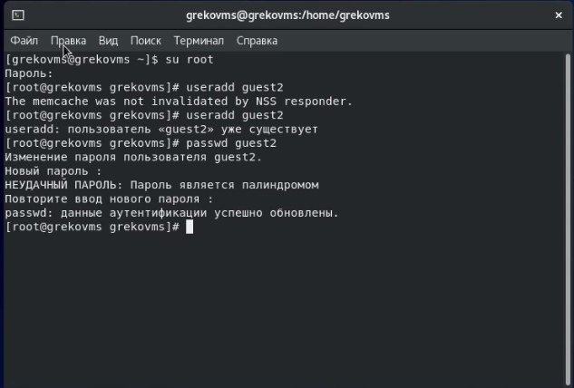{ #fig:001 width=70% }


## Добавление в группу

Добавили пользователя guest2 в группу guest с помощью команды ```gpasswd -a guest2 guest```

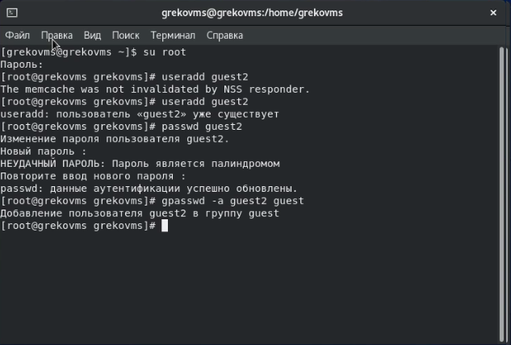{ #fig:002 width=70% }

## Два пользователя

Осуществили вход в систему от двух пользователей на двух разных консолях (вкладках): guest на первой консоли и guest2 на второй консоли

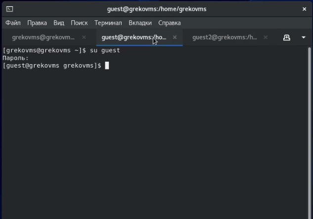{ #fig:003 width=70% }

## Текущая директория

Для обоих пользователей командой pwd определили директорию, в которой находились. Сравнили её с приглашениями командной строки и получили идентичные значения

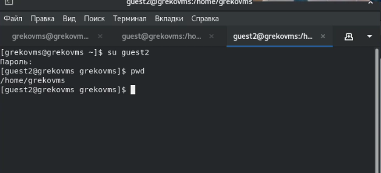{ #fig:004 width=70% }

## Группы пользователей

Уточнили имя пользователя, его группу, кто входит в неё и к каким группам принадлежит он сам. 

Определили командами groups guest и groups guest2, в какие группы входят пользователи guest и guest2. 

Сравнили вывод команды ```groups``` с выводом команд ```id -Gn``` и ```id -G```.

## Группы пользователей

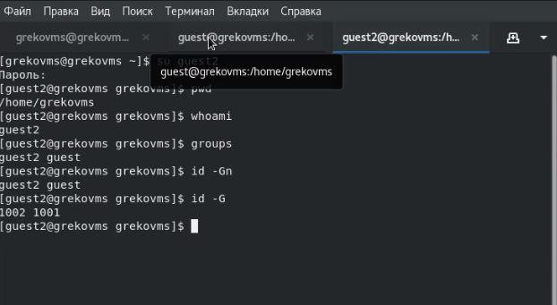{ #fig:005 width=70% }

## Файл /etc/group

Сравнили полученную информацию с содержимым файла /etc/group, посмотрели файл командой ```cat /etc/group```

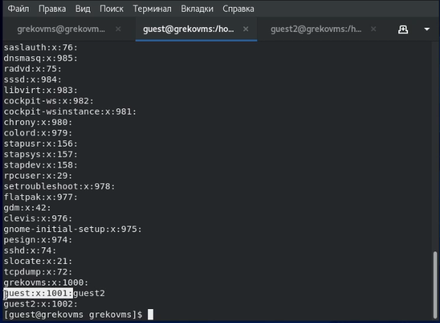{ #fig:006 width=70% }

## Регистрация в группе

От имени пользователя guest2 выполнили регистрацию пользователя guest2 в группе guest командой ```newgrp guest```

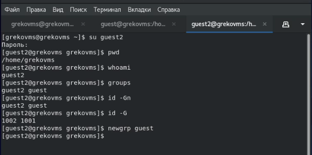{ #fig:007 width=70% }

## Права для группы

От имени пользователя guest изменили права директории /home/guest, разрешив все действия для пользователей группы, применили команду ```chmod g+rwx /home/guest```

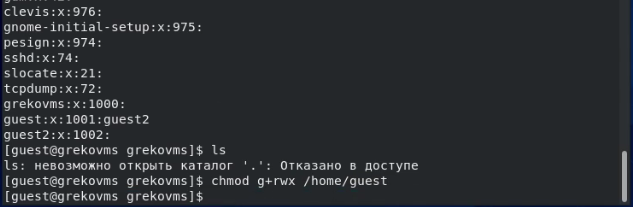{ #fig:008 width=70% }

## Снятие атрибутов

От имени пользователя guest сняли с директории /home/guest/dir1 все атрибуты командой ```chmod 000 dirl```, проверили правильность снятия атрибутов

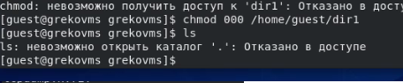{ #fig:009 width=70% }

## Таблицы

Меняя атрибуты у директории dir1 и файла file1 от имени пользователя guest и делая проверку от пользователя guest2, заполнили таблицу, определив опытным путём, какие операции разрешены, а какие нет. 

На основании заполненной таблицы определили те или иные минимально необходимые права для выполнения пользователем guest2 операций внутри директории dir1 и заполнили вторую таблицу.

## Таблицы

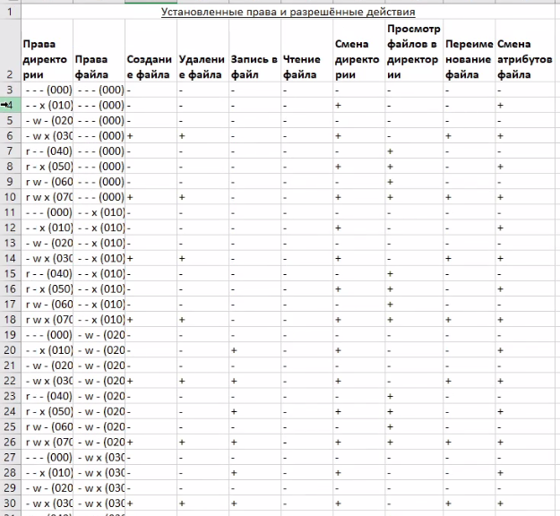{ #fig:010 width=70% }

## Таблицы

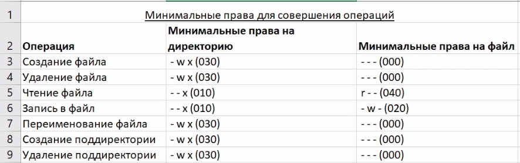{ #fig:011 width=70% }

# Вывод

## Вывод

В ходе лабораторной работы получили практические навыки работы в консоли с атрибутами файлов для групп пользователей

## {.standout}