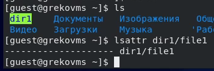
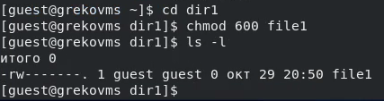
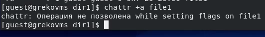
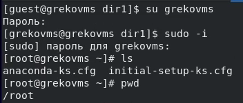
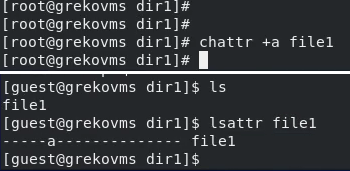
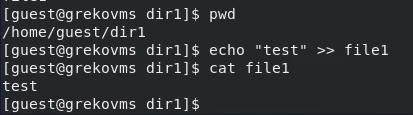
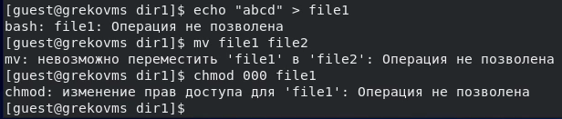
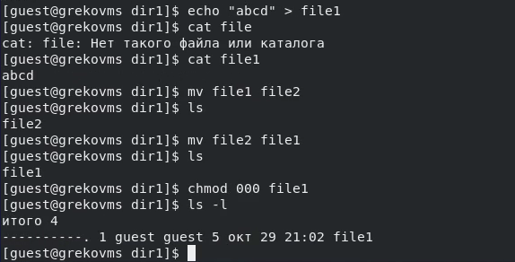
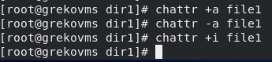
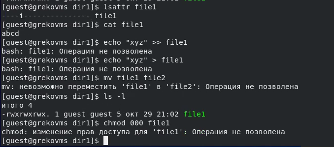

---
## Front matter
lang: ru-RU
title: "Л.4. Дискреционное разграничение прав в Linux. Расширенные атрибуты"
author: "Греков Максим Сергеевич"
institute: RUDN University, Moscow, Russian Federation
date: 2021

## Formatting
mainfont: PT Serif
romanfont: PT Serif
sansfont: PT Serif
monofont: PT Serif
toc: false
slide_level: 2
theme: metropolis
header-includes: 
 - \metroset{progressbar=frametitle,sectionpage=progressbar,numbering=fraction}
 - '\makeatletter'
 - '\beamer@ignorenonframefalse'
 - '\makeatother'
aspectratio: 43
section-titles: true
---

# Цель работы

## Цель работы

Целью данной лабораторной работы является получение практических навыков работы в консоли с расширенными атрибутами файлов

# Ход работы 

## Определение расширенных атрибутов

От имени пользователя guest определили расширенные атрибуты файла ```/home/guest/dir1/file1``` командой ```lsattr /home/guest/dir1/file1```

{ #fig:001 width=70% }

## Изменение прав на файл

Установили командой ```chmod 600 file1``` на файл ```file1``` права, разрешающие чтение и запись для владельца файла

{ #fig:002 width=70% }

## Расширенный атрибут a

Попробовали установить на файл ```/home/guest/dir1/file1``` расширенный атрибут ```a``` от имени пользователя guest:

```chattr +a /home/guest/dir1/file1```

В ответ получили отказ от выполнения операции. Дело в том, что расширенные атрибуты можно установить от имени администратора с root правами.

## Расширенный атрибут a

{ #fig:003 width=70% }

## Расширенный атрибут a

Зашли на вторую консоль с правами администратора. Попробовали установить расширенный атрибут ```a``` на файл ```/home/guest/dir1/file1``` от имени суперпользователя:

```chattr +a /home/guest/dir1/file1```

От пользователя guest проверили правильность установления атрибута: 

```lsattr /home/guest/dir1/file1```

## Расширенный атрибут a

{ #fig:004 width=70% }

## Расширенный атрибут a

{ #fig:005 width=70% }

## Работа с файлом с атрибутом а

Выполнили дозапись в файл ```file1``` слова «test» командой ```echo "test" >> /home/guest/dir1/file1```

После этого выполнили чтение файла ```file1``` командой ```cat /home/guest/dir1/file1```

Убедились, что слово test было успешно записано в ```file1```.

## Работа с файлом с атрибутом а

{ #fig:006 width=70% }

## Работа с файлом с атрибутом а

Попробовали стереть имеющуюся в файле информацию командой ```echo "abcd" > /home/guest/dirl/file1```

Попробовали переименовать файл командой ```mv file1 file2```

Попробовали с помощью команды ```chmod 000 file1```  установить на файл права, например, запрещающие чтение и запись для владельца файла

Все попытки не увенчались успехом потому, что расширенный атрибут ```a``` позволяет только добавление информации к файлу.

## Работа с файлом с атрибутом а

{ #fig:007 width=70% }

## Работа с файлом без атрибута а

Сняли расширенный атрибут a с файла ```/home/guest/dirl/file1``` от имени суперпользователя командой ```chattr -a /home/guest/dir1/file1```

Повторили операции, которые ранее не удавалось выполнить. Они были успешно выполнены, потому что мы предварительно сняли ограничение "только дозапись"

## Работа с файлом без атрибута а

{ #fig:008 width=70% }

## Работа с файлом с атрибутом i

Повторили прошлые действия по шагам, заменив атрибут «a» атрибутом «i».

Расширенный атрибут «i» говорит о том, что на файл накладывается ограничение неизменяемости. 

Поэтому произвести прошлые действия с файлом не удастся.

## Работа с файлом с атрибутом i

{ #fig:009 width=70% }

## Работа с файлом с атрибутом i

{ #fig:010 width=70% }

# Вывод

## Вывод

В результате выполнения работы повысили свои навыки использования интерфейса командой строки (CLI), познакомились на примерах с тем, как используются основные и расширенные атрибуты при разграничении доступа. 

Имели возможность связать теорию дискреционного разделения доступа (дискреционная политика безопасности) с её реализацией на практике в ОС Linux. 

Составили наглядные таблицы, поясняющие какие операции возможны при тех или иных установленных правах. 

Опробовали действие на практике расширенных атрибутов «а» и «i».

## {.standout}

