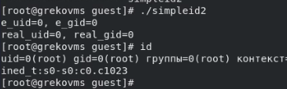
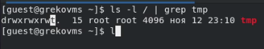
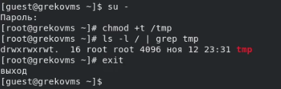

---
## Front matter
lang: ru-RU
title: "Л.5. Дискреционное разграничение прав в Linux. Исследование влияния дополнительных атрибутов"
author: "Греков Максим Сергеевич"
institute: RUDN University, Moscow, Russian Federation
date: 2021

## Formatting
mainfont: PT Serif
romanfont: PT Serif
sansfont: PT Serif
monofont: PT Serif
toc: false
slide_level: 2
theme: metropolis
header-includes: 
 - \metroset{progressbar=frametitle,sectionpage=progressbar,numbering=fraction}
 - '\makeatletter'
 - '\beamer@ignorenonframefalse'
 - '\makeatother'
aspectratio: 43
section-titles: true
---

# Цель работы

## Цель работы

Изучение механизмов изменения идентификаторов, применения SetUID- и Sticky-битов. 

Получение практических навыков работы в консоли с дополнительными атрибутами. 

Рассмотрение работы механизма смены идентификатора процессов пользователей, а также влияние бита Sticky на запись и удаление файлов.

# Подготовка лабораторного стенда

## Компилятор gcc

При подготовке стенда убедились, что в системе установлен компилятор gcc (для этого ввели команду gcc -v):

{ #fig:001 width=70% }

## Система запретов

Отключили систему запретов до очередной перезагрузки системы командой ```setenforce 0```

После этого команда ```getenforce``` вывела Permissive. 

{ #fig:002 width=70% }

# Ход работы 

## Программа simpleid.c

Вошли в систему от имени пользователя guest и создали программу simpleid.c:

{ #fig:003 width=70% }

## Компиляция simpleid.c

Скомплилировали программу и убедились, что файл программы создан:

```gcc simpleid.c -o simpleid```

{ #fig:004 width=70% }

## Выполнение simpleid.c и id

Выполнили программу simpleid: ```./simpleid```, а также системную программу id:

{ #fig:005 width=70% }

Получили идентичные результаты рассматриваемых параметров

## Программа simpleid2.c

Усложнили программу, добавив вывод действительных идентификаторов, и назвали её simpleid2.c:

{ #fig:006 width=70% }

## Компиляция и выполнение simpleid2.c

Скомпилировали и запустили программу simpleid2.c:

{ #fig:007 width=70% }

Теперь видим не только текущих группу и пользователя, но и владельца файла.

## Смена владельца и атрибут s

От имени суперпользователя выполнили команды:

```chown root:guest /home/guest/simpleid2```

```chmod u+s /home/guest/simpleid2```

Тем самым, сменили владельца файла и добавили ему дополнительный атрибут (SetUID).

Затем выполнили проверку правильности установки новых атрибутов и смены владельца файла simpleid2:

```ls -l simpleid2```

## Смена владельца и атрибут s

{ #fig:008 width=70% }

## Запуск simpleid2 с SetUID

Запустили simpleid2 и id, вновь получили идентичные результаты.

Убедились в принадлежности файла пальзователю root.

{ #fig:009 width=70% }

## Запуск simpleid2 с SetGID

Проделали то же самое относительно SetGID-бита:

{ #fig:010 width=70% }

## Программа readfile.c

Создали программу readfile.c:

{ #fig:011 width=70% }

## Компиляция и изменение readfile.c

Откомпилировали программу и изменили владельца у файла readfile.c и права так, чтобы только суперпользователь (root) мог прочитать его, a guest не мог, убедились в правильности, получив отказ в доступе:

{ #fig:012 width=70% }

## Изменение владельца readfile с SetUID

Сменили у программы readfile владельца и установили SetUID-бит:

{ #fig:013 width=70% }

## Попытка прочтения

Проверили, может ли программа readfile прочитать файлы readfile.c и /etc/shadow, в обоих случаях это не удалось, потому что владелец файла программы guest2:

{ #fig:014 width=70% }

## Атрибут Sticky на /tmp

Выяснили, что на директории /tmp установлен атрибут Sticky:

```ls -l / | grep tmp```

{ #fig:015 width=70% }

## Создание file01.txt

От имени пользователя guest создали файл file01.txt в директории /tmp со словом test:

```echo "test" > /tmp/file01.txt```

{ #fig:016 width=70% }

## Атрибуты file01.txt

Просмотрели атрибуты у только что созданного файла и разрешили чтение и запись для категории пользователей «все остальные»:

```chmod o+rw /tmp/file01.txt```

```ls -l /tmp/file01.txt```

{ #fig:017 width=70% }

## Работа с файлом file01.txt в директории с t

От пользователя guest2 (не являющегося владельцем) попробовали:

1. прочитать файл /tmp/file01.txt: ```cat /tmp/file01.txt```

2. дозаписать в файл /tmp/file01.txt слово test2: ```echo "test2" >> /tmp/file01.txt```

3. проверить содержимое файла: ```cat /tmp/file01.txt```

4. записать в файл /tmp/file01.txt слово test3, стерев при этом всю имеющуюся в файле информацию: ```echo "test3" > /tmp/file01.txt```

5. проверить содержимое файла: ```cat /tmp/file01.txt```

6. удалить файл /tmp/file01.txt: ```rm /tmp/fileOl.txt```

## Работа с файлом file01.txt в директории с t

Удалось дозаписать информацию в файл, перезаписать, прочитать, но не удалось удалить файл:

{ #fig:018 width=70% }

## Снятие атрибута t

Повысили свои права до суперпользователя командой ```su -```

Выполнили после этого команду, снимающую атрибут t (Sticky-бит) с директории /tmp: ```chmod -t /tmp```.

Покинули режим суперпользователя командой ```exit```

От пользователя guest2 проверили, что атрибута t у директории /tmp нет: ```ls -l / | grep tmp```

## Снятие атрибута t

{ #fig:019 width=70% }

## Работа с файлом file01.txt в директории без t

Повторили все действия и, в отличие от предыдущего раза, теперь уже нам удалось удалить файл:

{ #fig:020 width=70% }

## Возврат атрибута t

Повысили свои права с помощью su, вернули директории /tmp атрибут t:

{ #fig:021 width=70% }

# Вывод

## Вывод

Изучили механизмы изменения идентификаторов, применения SetUID- и Sticky-битов. 

Получили практические навыки работы в консоли с дополнительными атрибутами. 

Рассмотрели работы механизма смены идентификатора процессов пользователей, а также влияние бита Sticky на запись и удаление файлов.

## {.standout}


