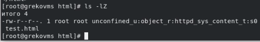
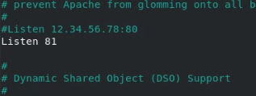

---
## Front matter
lang: ru-RU
title: "Л.6. Мандатное разграничение прав в Linux"
author: "Греков Максим Сергеевич"
institute: RUDN University, Moscow, Russian Federation
date: 2021

## Formatting
mainfont: PT Serif
romanfont: PT Serif
sansfont: PT Serif
monofont: PT Serif
toc: false
slide_level: 2
theme: metropolis
header-includes: 
 - \metroset{progressbar=frametitle,sectionpage=progressbar,numbering=fraction}
 - '\makeatletter'
 - '\beamer@ignorenonframefalse'
 - '\makeatother'
aspectratio: 43
section-titles: true
---

# Цель работы

## Цель работы

Развить навыки администрирования ОС Linux. 

Получить первое практическое знакомство с технологией SELinux.

Проверить работу SELinx на практике совместно с веб-сервером Apache.

# Подготовка лабораторного стенда

## ServerName

В конфигурационном файле */etc/httpd/httpd.conf* задали параметр ServerName (рис. -@fig:001): *ServerName test.ru*

Это нужно для того, чтобы при запуске веб-сервера не выдавались лишние сообщения об ошибках, не относящихся к лабораторной работе.

{ #fig:001 width=70% }

## Пакетный фильтр

Проследили, чтобы пакетный фильтр был отключён, для этого воспользовались командами (рис. -@fig:002):

- ```iptables -F```
- ```iptables -P INPUT ACCEPT```
- ```iptables -P OUTPUT ACCEPT```

{ #fig:002 width=70% }

# Порядок выполнения работы

## Режим SELinux 

Вошли в систему со своими учётными данными и убедитесь (рис. -@fig:003), что SELinux работает в режиме *enforcing* политики *targeted* с помощью команд:

- ```getenforce```
- ```sestatus```

{ #fig:003 width=70% }

## Рабочий веб-сервер

Обратились через терминал к веб-серверу (рис. -@fig:004), запущенному на компьютере, и убедились, что последний работает:

- ```service httpd status```
- ```/etc/rc.d/init.d/httpd status```

{ #fig:004 width=70% }

## Веб-сервер Apache

Нашли веб-сервер Apache (рис. -@fig:005) в списке процессов, определили его контекст безопасности: 

- ```ps auxZ | grep httpd```

{ #fig:005 width=70% }

## Переключатели SELinux для Apache

Посмотрели текущее состояние переключателей SELinux для Apache с помощью команды:

- ```sestatus -bigrep httpd```

Обратили внимание (рис. -@fig:006), что многие из них находятся в положении *«off»*:

{ #fig:006 width=70% }

## Команда seinfo

Посмотрели статистику по политике с помощью команды ```seinfo``` (рис. -@fig:007), также определили множество пользователей, ролей, типов:

{ #fig:007 width=70% }

## Тип файлов и поддиректорий www

Определили тип файлов и поддиректорий (рис. -@fig:008), находящихся в директории */var/www*, с помощью команды:

- ```ls -lZ /var/www```

{ #fig:008 width=70% }

## Тип файлов и поддиректорий html

Определили тип файлов (рис. -@fig:009), находящихся в директории */var/www/html* с помощью команды:

- ```ls -lZ /var/www/html```

Убедились, что файлы отсутствуют.

{ #fig:009 width=70% }

## Cоздание файлов в директории html

Определили круг пользователей (рис. -@fig:010), которым разрешено создание файлов в директории */var/www/html* - пользователи с root правами:

{ #fig:010 width=70% }

## Создание test.html

Создали от имени суперпользователя html-файл */var/www/html/test.html* (рис. -@fig:011) следующего содержания:

```
<html>
<body>test</body>
</html>
```

{ #fig:011 width=70% }

## Проверка контекста

Проверили контекст созданного файла и контекст, присваиваемый по умолчанию (рис. -@fig:012) вновь созданным файлам в директории */var/www/html*:

{ #fig:012 width=70% }

## Файл из браузера и справка

Обратитились к файлу через веб-сервер, введя в браузере адрес *http://127.0.0.1/test.html*. 

Убедились, что файл был успешно отображён.

Изучили справку *man httpd_selinux* и выяснили, какие контексты файлов определены для httpd. 

## Изменение контекста

Изменили контекст файла */var/www/html/test.html* (рис. -@fig:013) с *httpd_sys_content_t* на *samba_share_t*, к которому процесс httpd не
должен иметь доступа, и проверили, что он поменялся:

- ```chcon -t samba_share_t /var/www/html/test.html```
- ```ls -Z /var/www/html/test.html```

{ #fig:013 width=70% }

## Доступ к файлу

Попробовали получить доступ к файлу через веб-сервер, введя в браузере адрес *http://127.0.0.1/test.html*, и получили сообщение об ошибке.

Хоть права доступа и позволяют читать этот файл любому пользователю (рис. -@fig:014), однако из-за контекста файл нет был отображён.

- ```ls -l /var/www/html/test.html```

{ #fig:014 width=70% }

## Log-файлы веб-сервера Apache

Просмотрели log-файлы веб-сервера Apache, также просмотрели системный лог-файл (рис. -@fig:015):

- ```tail /var/log/messages```

{ #fig:015 width=70% }

## Прослушивание ТСР-порта 81

Попробовали запустить веб-сервер Apache на прослушивание ТСР-порта 81 (рис. -@fig:016) (а не 80, как рекомендует IANA и прописано в */etc/services*). 

Для этого в файле */etc/httpd/httpd.conf* нашли строчку *Listen 80* и заменили её на *Listen 81*, потом выполнили перезапуск сервера.

{ #fig:016 width=70% }

## Анализ файлов

Просмотрели (рис. -@fig:017) и проанализировали файлы */var/log/messages*, */var/log/http/error_log*, */var/log/http/access_log* и */var/log/audit/audit.log*:

{ #fig:017 width=70% }

## Добавление порта 81

Выполнили команду *semanage port -a -t http_port_t -р tcp 81* (рис. -@fig:018)

После этого проверили список портов командой *semanage port -l | grep http_port_t* и убедились, что порт 81 появился в списке, затем выполнили перезапуск сервера.

{ #fig:018 width=70% }

## Возврат контекста

Вернули контекст *httpd_sys_cоntent_t* к файлу */var/www/html/ test.html*:

- ```chcon -t httpd_sys_content_t /var/www/html/test.html```

После этого попробовали получить доступ к файлу через веб-сервер, введя в браузере адрес *http://127.0.0.1:81/test.html*, увидели его содержимое.

## Откат изменений

- Исправили обратно конфигурационный файл *apache*, вернув *Listen 80*.

- Удалили привязку *http_port_t* к 81 порту: ```semanage port -d -t http_port_t -p tcp 81``` (рис. -@fig:019)

- Удалили файл */var/www/html/test.html*: ```rm /var/www/html/test.html```

{ #fig:019 width=70% }

# Вывод

## Вывод

Развили навыки администрирования ОС Linux. 

Получили первое практическое знакомство с технологией SELinux.

Проверили работу SELinx на практике совместно с веб-сервером Apache.

## {.standout}


