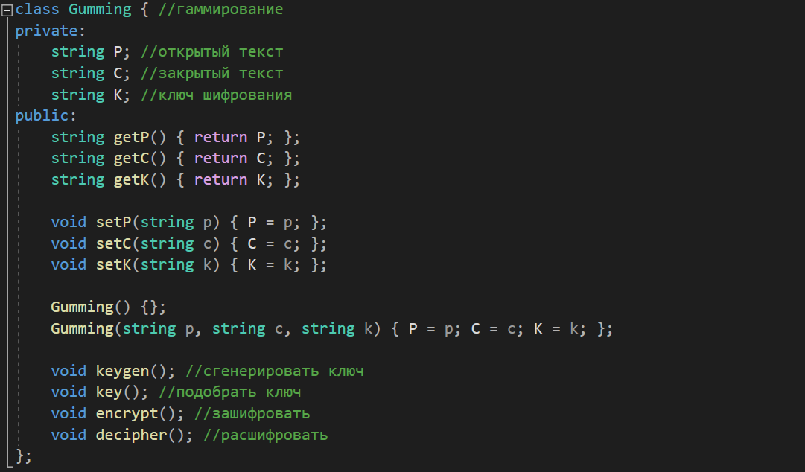
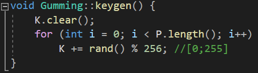
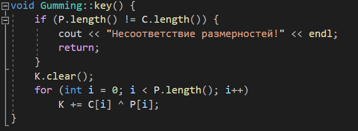
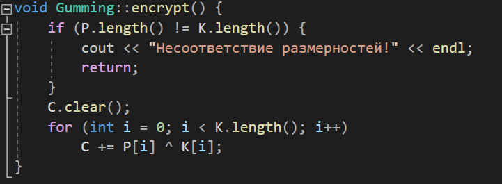
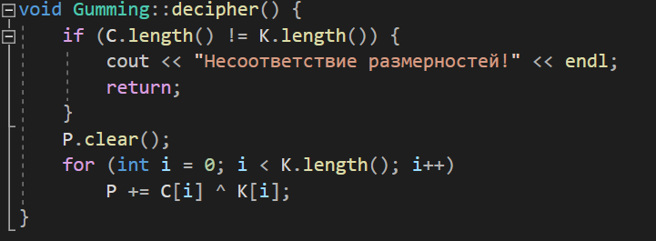
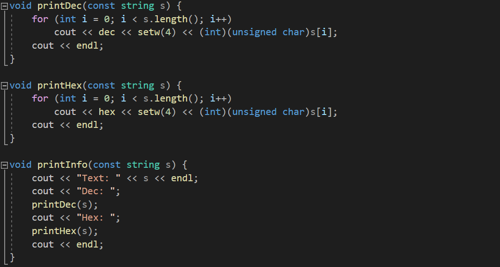
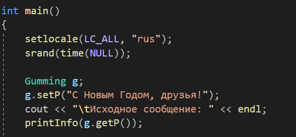
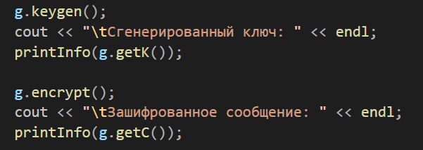
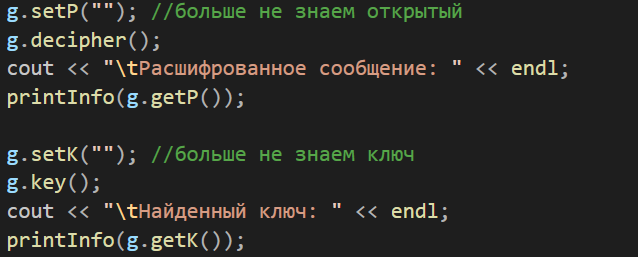
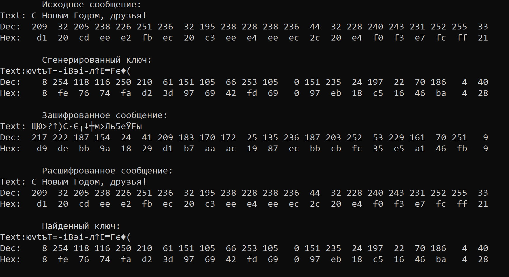

---
## Front matter
lang: ru-RU
title: "Л.7. Элементы криптографии. Однократное гаммирование"
author: "Греков Максим Сергеевич"
institute: RUDN University, Moscow, Russian Federation
date: 2021

## Formatting
mainfont: PT Serif
romanfont: PT Serif
sansfont: PT Serif
monofont: PT Serif
toc: false
slide_level: 2
theme: metropolis
header-includes: 
 - \metroset{progressbar=frametitle,sectionpage=progressbar,numbering=fraction}
 - '\makeatletter'
 - '\beamer@ignorenonframefalse'
 - '\makeatother'
aspectratio: 43
section-titles: true
---

# Цель работы

## Цель работы

Освоить на практике применение режима однократного гаммирования

# Задание

## Задание

Нужно подобрать ключ, чтобы получить сообщение «С Новым Годом, друзья!». Требуется разработать приложение, позволяющее шифровать и дешифровать данные в режиме однократного гаммирования. Приложение должно:  

1. Определить вид шифротекста при известном ключе и известном открытом тексте.  
2. Определить ключ, с помощью которого шифротекст может быть преобразован в некоторый фрагмент текста, представляющий собой один из возможных вариантов прочтения открытого текста.

# Теория

## Гаммирование

Гаммирование представляет собой наложение (снятие) на открытые (зашифрованные) данные последовательности элементов других данных, полученной с помощью некоторого криптографического алгоритма, для получения зашифрованных (открытых) данных. Иными словами, наложение гаммы — это сложение её элементов с элементами открытого (закрытого) текста по некоторому фиксированному модулю, значение которого представляет собой известную часть алгоритма шифрования.

## Как применять 

В соответствии с теорией криптоанализа, если в методе шифрования используется однократная вероятностная гамма (однократное гаммирование) той же длины, что и подлежащий сокрытию текст, то текст нельзя раскрыть. Даже при раскрытии части последовательности гаммы нельзя получить информацию о всём скрываемом тексте. Наложение гаммы по сути представляет собой выполнение операции сложения по модулю 2 между элементами гаммы и элементами подлежащего сокрытию текста.

## Нахождение шифротекста

Если известны ключ и открытый текст, то задача нахождения шифротекста заключается в применении к каждому символу открытого текста следующего правила:
$$C_{i} = P_{i} ⊕ K_{i}$$
где $C_{i}$ — i-й символ получившегося зашифрованного послания, $P_{i}$ — i-й символ открытого текста, $K_{i}$ — i-й символ ключа. Размерности открытого текста и ключа должны совпадать, и полученный шифротекст будет такой же длины.

## Нахождение ключа

Если известны шифротекст и открытый текст, то, чтобы найти ключ, обе части равенства необходимо сложить по модулю 2 с $P_{i}$:
$$C_{i} ⊕ P_{i} = P_{i} ⊕ K_{i} ⊕ P_{i} = K_{i},$$
$$K_{i} = C_{i} ⊕ P_{i}$$

## Стойкость шифра

К. Шеннон доказал абсолютную стойкость шифра в случае, когда однократно используемый ключ, длиной, равной длине исходного сообщения, является фрагментом истинно случайной двоичной последовательности с равномерным законом распределения. Криптоалгоритм не даёт никакой информации об открытом тексте: при известном зашифрованном сообщении C все различные ключевые последовательности K возможны и равновероятны, а значит, возможны и любые сообщения P.

## Условия стойкости шифра

Необходимые и достаточные условия абсолютной стойкости шифра:  

- полная случайность ключа;  
- равенство длин ключа и открытого текста;  
- однократное использование ключа.  

# Ход работы

## Класс Gumming

Для разработки приложения был описан класс *Gumming* (рис. -@fig:001), описывающий интересующие нас поля (открытый текст, закрытый текст, ключ шифрования), а также методы для работы с ними:

{ #fig:001 width=70% }

## Метод keygen()

Метод *keygen()* (рис. -@fig:002) позволяет сгенерировать псевдослучайный ключ такой же длины, как и открытый текст:

{ #fig:002 width=70% }

## Метод key()

Метод *key()* (рис. -@fig:003) позволяет получать ключ, зная открытый и закрытый текст:

{ #fig:003 width=70% }

## Метод encrypt()

Метод *encrypt()* (рис. -@fig:004) позволяет зашифровывать текст (получать закрытый текст), зная открытый текст и ключ:

{ #fig:004 width=70% }

## Метод decipher()

Метод *decipher()* (рис. -@fig:005) позволяет расшифровывать текст (получать открытый текст), зная закрытый текст и ключ:

{ #fig:005 width=70% }

## Вывод информации

Также были реализованы методы (рис. -@fig:006), служащие для вывода информации на экран в различных представлениях (текстовое, десятичное, шестнадцатеричное):

{ #fig:006 width=70% }

## Главная программа

В главной программе подключили кириллические символы в консоль (рис. -@fig:007), сгенерировали псевдослучайную последовательность, создали объект класса, установили открытый текст *"С Новым Годом, друзья!"*:

{ #fig:007 width=70% }

## Главная программа

Затем вызвали методы для генерации псевдослучайного ключа и зашифровки текста (рис. -@fig:008). Всю информацию поэтапно выводим на экран:

{ #fig:008 width=70% }

## Главная программа

После этого проверили работу методов для расшифровки и нахождения ключа (рис. -@fig:009), убедились в корректности работы программы по информации, получанной в консоли (рис. -@fig:010):

{ #fig:009 width=70% }

## Вывод программы

{ #fig:010 width=100% }

# Вывод

## Вывод 

Освоили на практике применение режима однократного гаммирования

## {.standout}

