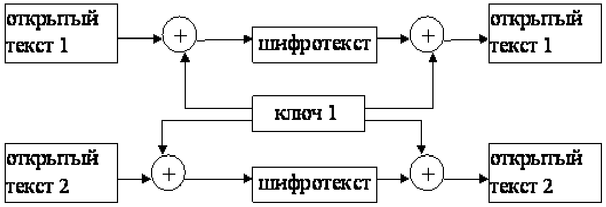
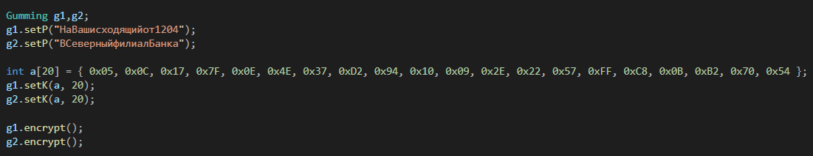
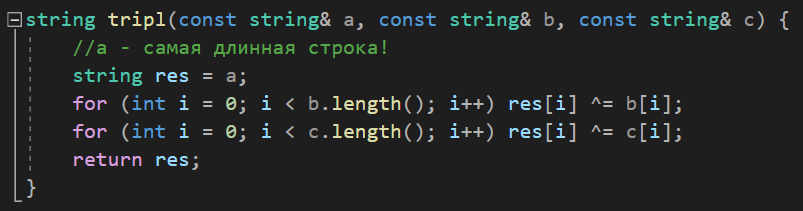
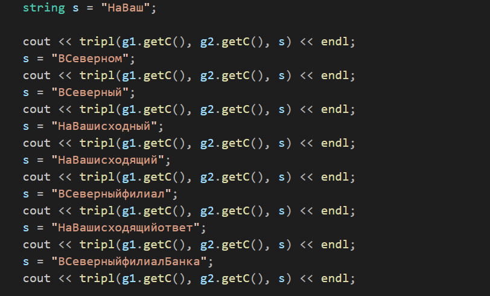
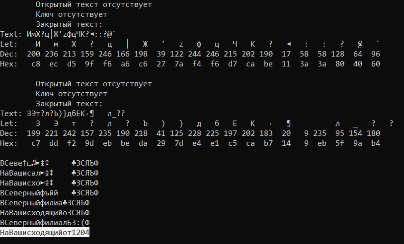

---
## Front matter
lang: ru-RU
title: "Л.8. Элементы криптографии. Шифрование (кодирование) различных исходных текстов одним ключом"
author: "Греков Максим Сергеевич"
institute: RUDN University, Moscow, Russian Federation
date: 2021

## Formatting
mainfont: PT Serif
romanfont: PT Serif
sansfont: PT Serif
monofont: PT Serif
toc: false
slide_level: 2
theme: metropolis
header-includes: 
 - \metroset{progressbar=frametitle,sectionpage=progressbar,numbering=fraction}
 - '\makeatletter'
 - '\beamer@ignorenonframefalse'
 - '\makeatother'
aspectratio: 43
section-titles: true
---

# Цель работы

## Цель работы

Освоить на практике применение режима однократного гаммирования на примере кодирования различных исходных текстов одним ключом.

# Теория

## Однократное гаммирование одним ключом

Режим шифрования однократного гаммирования одним ключом двухвидов открытого текста реализуется в соответствии со схемой (рис. -@fig:001)

{ #fig:001 width=70% }

## Шифротексты телеграмм

Шифротексты обеих телеграмм можно получить по формулам режима однократного гаммирования:

$$C_{1} = P_{1} ⊕ K_{i}$$
$$C_{2} = P_{2} ⊕ K_{i}$$

Открытый текст можно найти в соответствии с (рис. -@fig:001), зная шифротекст двух телеграмм, зашифрованных одним ключом.

## Следствие свойства операции XOR

Для это оба равенства складываются по модулю 2. Тогда получаем:

$$C_{1} ⊕ C_{2} = P_{1} ⊕ K ⊕ P_{2} ⊕ K = P_{1} ⊕ P_{2}$$

Предположим, что одна из телеграмм является шаблоном — т.е. имеет текст фиксированный формат, в который вписываются значения полей.

## Получение второго открытого текста по первому 

Допустим, что злоумышленнику этот формат известен. Тогда он получает достаточно много пар $C_{1} ⊕ C_{2}$ (известен вид обеих шифровок).

Тогда зная *P1*, имеем: 

$$C_{1} ⊕ C_{2} ⊕ P_{1} = P_{1} ⊕ P_{2} ⊕ P_{1} = P_{2}$$

## Получение второго открытого текста по первому 

Таким образом, злоумышленник получает возможность определить те символы сообщения *P2*, которые находятся на позициях известного шаблона сообщения *P1*. 

В соответствии с логикой сообщения *P2*, злоумышленник имеет реальный шанс узнать ещё некоторое количество символов сообщения *P2*. 

## Получение второго открытого текста по первому 

Затем вновь используется описанное свойство с подстановкой вместо *P1* полученных на предыдущем шаге новых символов сообщения *P2*. И так далее.

Действуя подобным образом, злоумышленник даже если не прочитает оба сообщения, то значительно уменьшит пространство их поиска.

# Ход работы

## Исходные данные

Рассмотрим две телеграммы Центра:

- *P1* = НаВашисходящийот1204
- *P2* = ВСеверныйфилиалБанка

Ключ Центра длиной 20 байт:

*K* = 05 0C 17 7F 0E 4E 37 D2 94 10 09 2E 22 57 FF C8 0B B2 70 54

## Код исходных данных

Установим данные значения в соответствующие поля (рис. -@fig:002), используя программный код, реализованный в ходе предыдущий лабораторной, и получим шифротексты.

{ #fig:002 width=100% }

## Функция tripl()

Реализуем функцию (рис. -@fig:003), принимающую три строки, и возвращающую их совместное наложение операцией *XOR*, согласно описанному раннее свойству.

{ #fig:003 width=100% }

## Последовательные вызовы tripl()

Предположим, что злоумышленник знает начало первого сообщения *"НаВаш"*. 

Пользуясь *tripl()* (рис. -@fig:004) пробуем расшифровать имеющиеся сообщения последовательной подстановкой в функцию открытых участков то первого, то второго сообщения, постепенно подбирая (рис. -@fig:005) продолжения уже имеющихся участков, тем самым увеличивая длину расшифрованных последовательностей.

Таким образом удалось полность расшифровать оба сообщения.

## Последовательные вызовы tripl()

{ #fig:004 width=100% }

## Последовательные открытия участков

{ #fig:005 width=100% }

# Вывод

## Вывод

Освоили на практике применение режима однократного гаммирования на примере кодирования различных исходных текстов одним ключом.

## {.standout}

